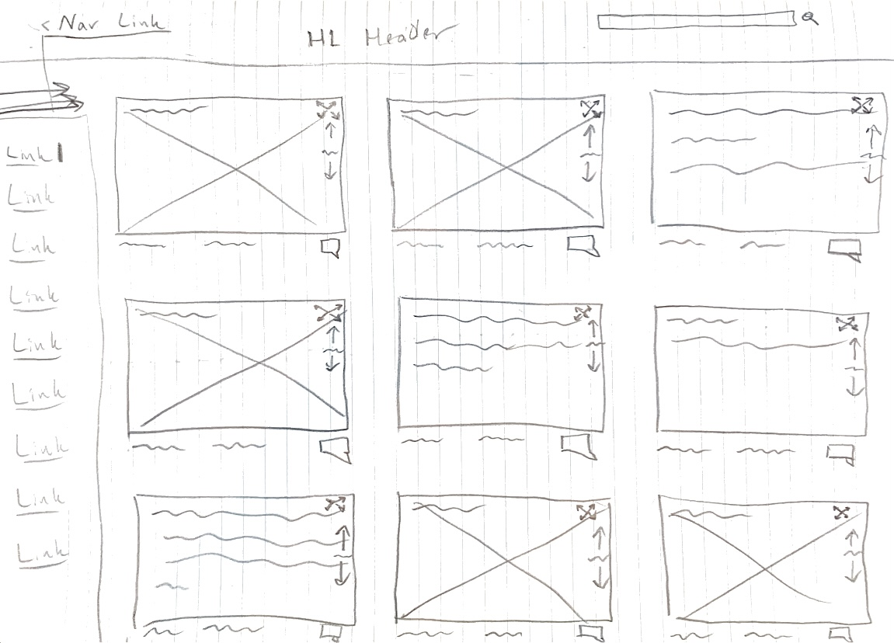
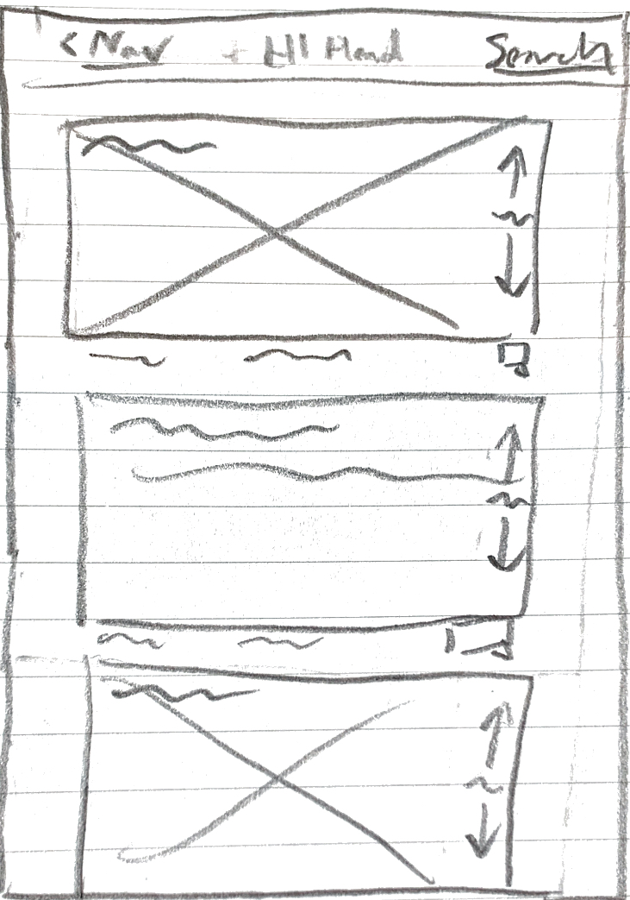
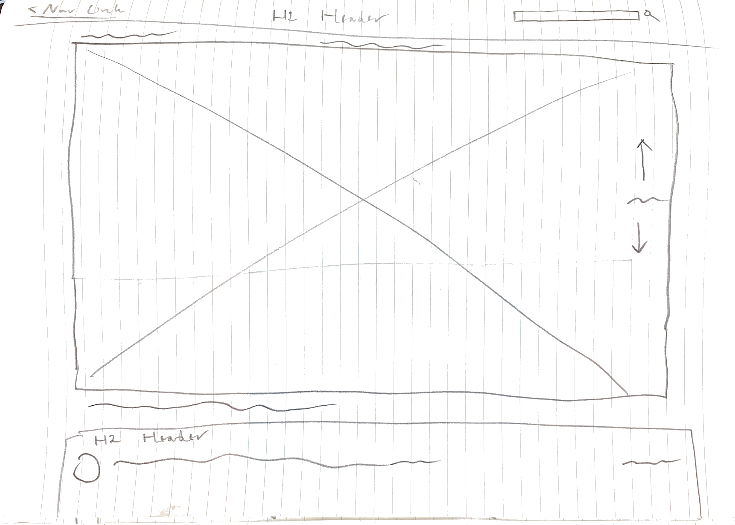
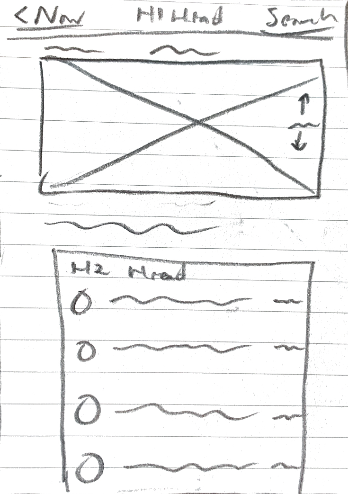
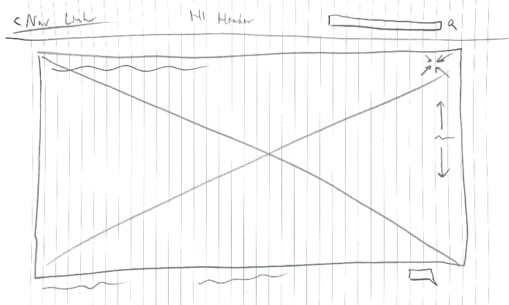

# Reddit Client App

## The Objective

Build a client app for Reddit with the knowledge of utilizing React and Redux, including writing unit tests with Jest 
and Enzyme. The app is used for fewer and simpler tasks like viewing, searching, and commenting on posts.

## Requirements

 - Build the app with React and Redux.
 - Version control with Git and hosting it with GitHub and Netlify.
 - Plan the app with GitHub Projects
 - Write unit tests for components with Jest and Enzyme.
 - Conduct E2E tests.
 - Make the app responsive to both mobile and desktop, including other browsers.
 - Users have access to the URL of the app.
 - Users can do these things on the app: see the initial view of the data, search and filter data.
 - Follows a cohesive design system for outstanding user experience.
 - Users are shown a detailed view when selecting an item.
 - Animations and transitions attracts the users.
 - Users are able to leave an error state.
 - Get 90+ performance score on [Lighthouse](https://pagespeed.web.dev/).

## Wireframes

### Home Page

#### Desktop

(You may have to download this image and turn it sideways to view it better.)

#### Mobile

### Viewing Comments

#### Desktop

#### Mobile

### Expanding Post on Desktop

